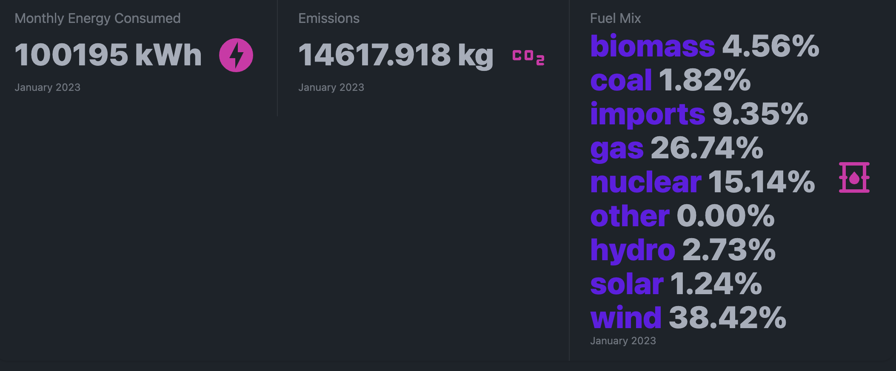

# OpenVolt Test



## Build Setup

```bash
# Copy the `.env.example` file to `.env` and add your OpenVolt API key and meter ID
cp .env.example .env
```

```bash
# install dependencies
$ pnpm install

# serve with hot reload at localhost:3000
$ pnpm dev

# build for production and launch server
$ pnpm build
$ pnpm start
```
